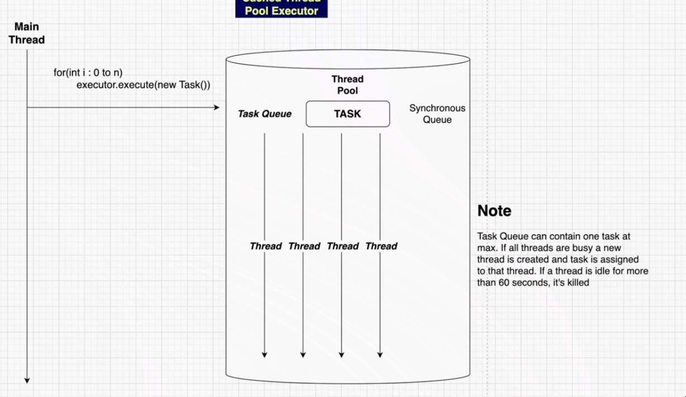

## CachedThreadPool

- The task queue here is of a special type called a `Synchronous queue`
- A `Synchronous Queue` only have space for a single task
	- so every time we submit a new task the CachedThreadPool holds the task in a Synchronous queue
	- it searches for queue which are present and not working actively on any task
	- if no such threads are available, the executor thread will create a new thread and add it to the thread pool
	- and this newly created threadpool starts to execute the task which has been submitted
	- after the threads are done doing a task and available to pick another task, and if they don't have any other task they are killed and time of idleness is 60 seconds

