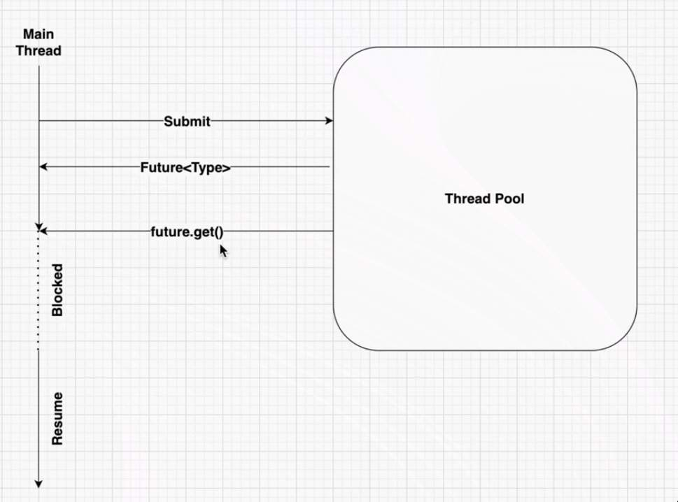

## Callable and Future

- What if we want to return something from the thread execution?
- `Future<Integer> num = service.submit(new ReturnValueTask());`
	- `submit` expects us to pass either a runnable or a callable
	- for `Callable` we need to specify `submit` method itself, because we cannot submit a `Callable` by using `execute` method

- Future is a placeholder it is empty till the time the processing is not completed, this time could be anything depending on the time of execution that you have

- At a point of time when we called `future.get()` and it did not have the final calculated value
	- Future is a blocking operation
	- If we call future and if there is not value inside the future, then the entire `main` thread execution will be blocked
	- Let's say after some point of time the future will get the value and the main thread execution also starts

- `get(long timeout, TimeUnit unit)` -> overloaded method
	- where in the main method wait's until this timeout is reached and throws a `TimeoutExeception` if the `future` does not get value within this time.

### other methods to handle the futures

1. `cancel()`
	- expects us to pass a `true` or `false` boolean
		- if `true` then `mayInterruptIfRunning`
			- say if the thread was running, it may get interrupted
		- if `false` then the thread will not be interrupted
2. `boolean cancelled = future.isCancelled()`
	- based on this we can check if the given future is cancelled or not
3. `boolean done = future.isDone()`
	- tells whatever thread was being executed has completed
	> [!NOTE]
	> this will return `true` for both cases wherein the thread is going to run successfully and return some value or the thread is getting interrupted due to some error or exception.
