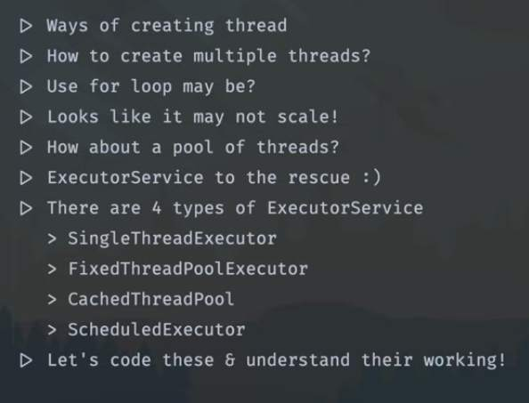
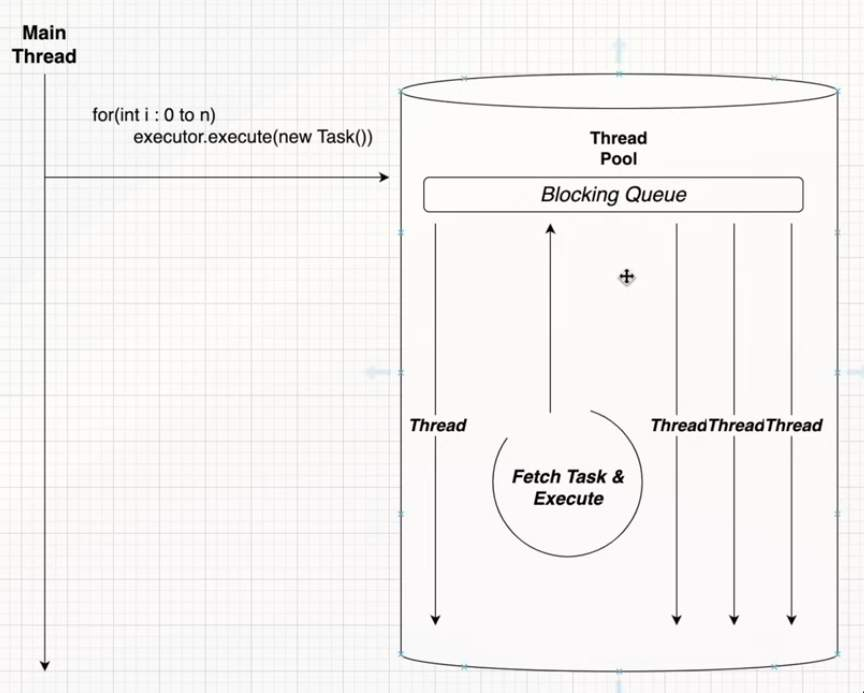

## ExecutorService

- We can define ExecutorService as a tool in java, in managing and running tasks concurrently accross multiple threads, so ExecutorService helps us create a pool of threads(TreadPool)
- The threads are not killed once they are done executing the task rather they are reused to execute another task, thus by using ExecutorService we save time needed for thread creation and making things more efficient and managable
- Three are four 4 types of ExecutorService
1. SingleThreadExecutor
2. FixedThreadExecutor
3. CachedThreadExecutor
4. ScheduledExecutor

- main thread calls -> executor.execute(new Task)
- The task should be picked by either of thread in the thread pool and it must be executed
- it will be inside `Blocking queue`
- simply speaking the executor will have two things, first is the `ThreadPool` and a `PriorityQueue`
- There are just two steps
1. The new task will be kept on adding to the `Blocking queue`
2. The thread which is available to execute the new task, can pick the task from the blocking queue, once the execution is done it will pick another task from the blocking queue 
