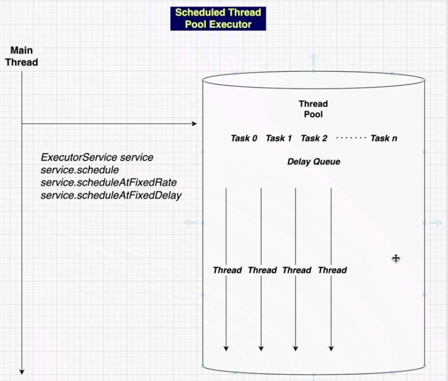

## ScheduledThreadPool

- this thread pool is for kind of task that we want to schedule in some manner, the way this works is all the tasks are submitted in a task queue but this queue is a `delay queue`
- in `delay queue` tasks are not kept in sequential manner
- we can understand this as some sort of priority queue

- `shutdown()`
	- Initiates an orderly `shutdown` in which previously submitted tasks are executed, but no new tasks will be accepted 
		- Invocations have no additional effect if already shutdown
	- once you call shutdown new task won't be allowed to come inside the task queue
	- This method does not wait for previously submitted tasks to complete execution 

- `shutdownNow()`
	- Attempts to stop all actively executing task, halts the processing of waiting tasks and returns a list of tasks that were awaiting execution
	- This method does not wait for actively executing tasks to terminate we have to use `awaitTermination` to do that
	- There are no guarantees beyond best-effort attempts to stop processing actively executing tasks, for example typical implementation will cancel via `{Thread Interrupt}`, so any task that fails to respond to interrupts may never terminate. 

