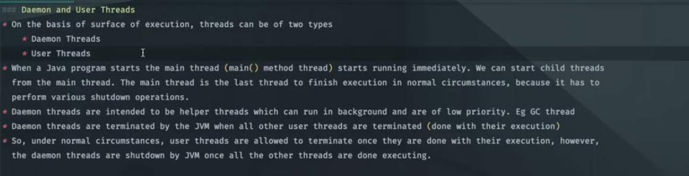

## Daemon and User Threads 

- **User Threads (Non-Daemon Threads)**:
    - These are high-priority threads that perform critical application tasks.
    - The Java Virtual Machine (JVM) will wait for all user threads to complete their execution before it terminates.
    - The `main` thread is always a user thread by default.
    - If even one user thread is still running, the JVM will continue to run, regardless of how many daemon threads are active.

- **Daemon Threads**:
    - These are low-priority threads that run in the background, providing services to user threads.
    - They are not essential for the application's core logic.
    - The JVM does *not* wait for daemon threads to complete. It terminates automatically when all user (non-daemon) threads have finished their execution.
    - When the last user thread finishes, all running daemon threads are abruptly terminated.
    - Examples in Java include the Garbage Collector (GC) thread and the Finalizer thread.
    - To make a thread a daemon thread, you must call `thread.setDaemon(true)` *before* starting the thread (`thread.start()`). If called after `start()`, it will throw an `IllegalThreadStateException`.
