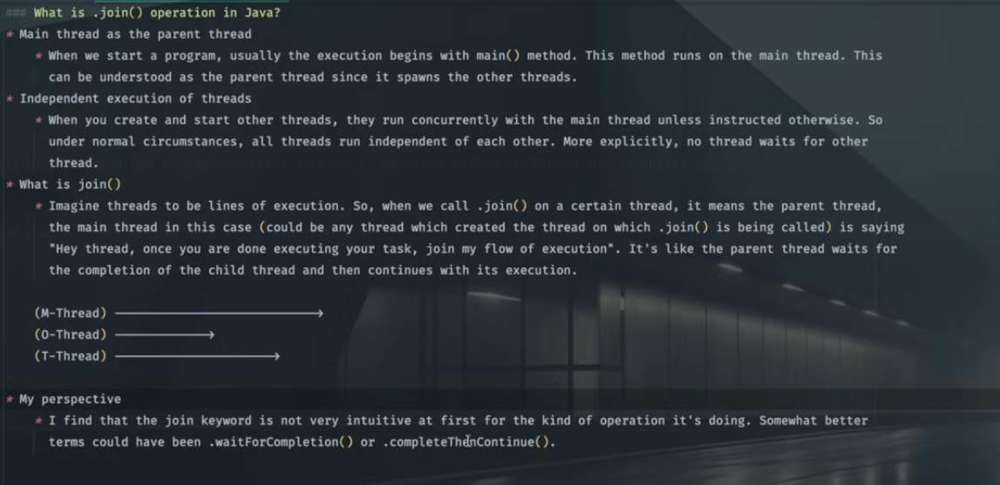
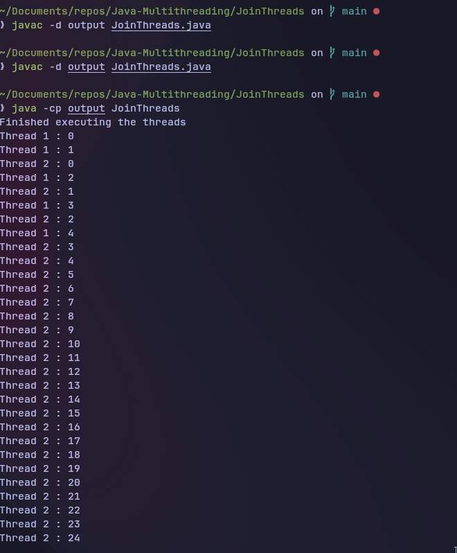
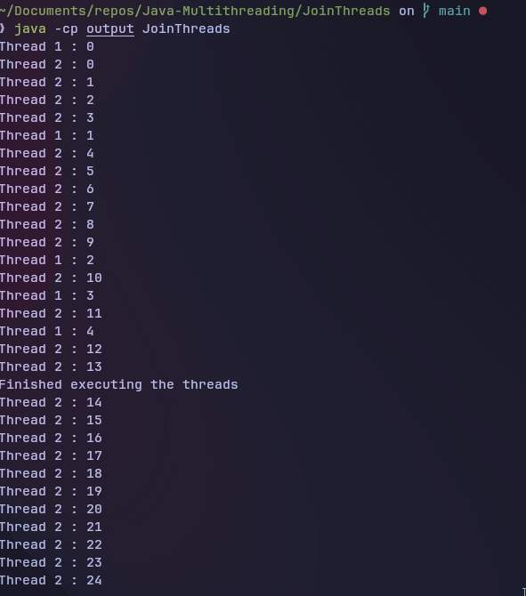
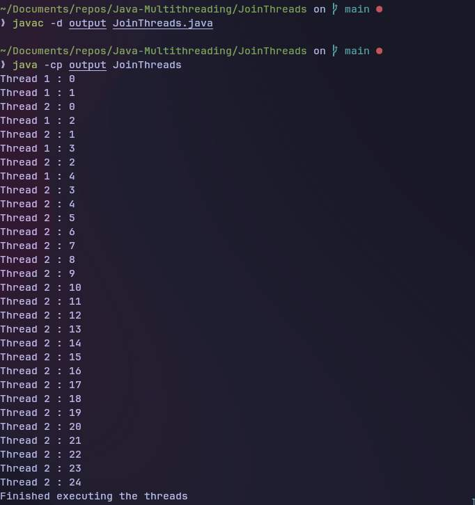

## Join Threads

- Main Thread is the first thread and it will have the `highest priority` so the print statement
`Done executing the threads` shows up first.

- After adding `one.join()` method 

	- Thread one have to complete first
	- then the main Thread takes over and then thread two executes

- If we want the main thread to execute only after both Thread one or two completes we have to use join method on second thread object `two.join()`

- The thread will be in `Runnable` state only when we do a `.start()` or call this method

