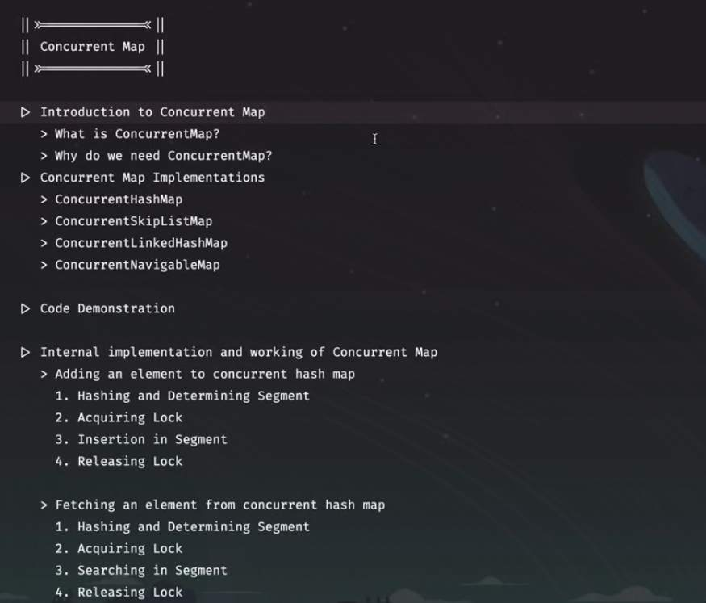

## Concurrent Map

- Intro
	- `Concurrent Map` is an interface in java, which represents a map, that can be safely accessed and modified concurrently by multiple threads, it extends the map interface and provides additional atomic operations to support concurrent actions without the need for explicit synchronization

### Concurrent Map implementation

1. `ConcurrentHashMap`
2. `ConcurrentSkipListMap`
3. `ConcurrentLinkedHashMap`
4. `ConcurrentNavigableMap`
