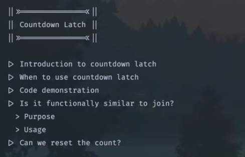

## Countdown Latch

- Introduction to countdown latch
	- Countdown latch is a `synchronization utility` that allows one or more threads to wait until a set of operations being performed in another thread completes 
	- Key concept of countdown latch is that, it maintains a count and it starts from a specific number and decreases each time when the countdown method is called
	- Threads that needs to wait for the countdown to reach zero can call the `await` method, which will block until the count becomes zero

- When to use countdown latch?
	- If there is a main task and it is divided into multiple subtasks, countdown latch enables to go further with the main task once and only all the subtasks are completed successfully. 
	- latch is basically a counter which will decrement itself when a task is completed using the method `latch.countDown()`.
	- once the latch decrements to zero the `await` method in the main thread will release like a dependency and main thread starts processing
	
- Is it functionally similar to join? 
	- purpose perspective
		- `Countdown latch` is designed to allow one or more threads to wait until a set of operations in other thread completes, it is typically used for coordination among multiple threads
		- `join` on the other hand is used to wait for a thread to complete the execution before proceeding with the rest of the code and is specifically used for thread synchronization in a single threaded context  
	- usage perspective
		- `Countdown latch` is useful when you have multiple thread performing independent tasks and we want to coordinate them without moving forward.
		- `join` is useful when we have main thread that spawns worker thread and needs to wait for them to finish before continuing it's execution

- Can we reset the count?
	- `Countdown latch` is supposed to be used as a one shot solution, so we cannot reset the count
	- If we need a solution which resets the count, we have to use `Cyclic barrier`

