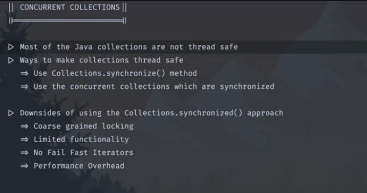

## Concurrent Collections

- Downside of using `Collection.synchronized()` method
1. Coarse grained locking
	- It uses a single lock to synchronize all the operation on the collection, this means only one thread can access the collection at a given time.
	- even though multiple threads are performing unrelated operations, this can lead to contention and reduced concurrency, especially if there are frequent read and write operations on the collections from different threads
2. Limited functionality
	- the synchronized wrapper exposed by Collection.synchronized() does not expose any additional methods of fine grained locking or custom synchronization strategy
3. There are no fail fast iterators
	- Collection returned by Collections.synchronized() list do not support fail fast Iterators, the fail fast iterators throw a `concurrent modification exception` if the collection is structurally modified if when an iterator is iterating over it. Without fail fast iterators it is possible for concurrent modifications to the collections to go unnoticed and it can lead to certain unexpected behaviours.
4. Performance overhead
	- Synchronization introduces overhead using lock acquisition and release, this overhead can degrade performance especially in high throughput and latency sensitive applications.
